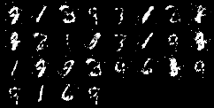

### Pytorch for Deep Learning 

In this Section, I have implemented Pytorch projects related to NLP tasks such as 

   

 > **word/character generation using RNN and LSTM**
 
 > **Classifiying Names using LSTM** 
 
 > **Sentiment Classification using RNN**
 
 > **Generating Images like MNIST or Celebrity faces using GANs Network.**

### Things you will learn

* Creating standard project using Pytorch for both NLP and CV tasks.
* What is zero_grad() ?
* what is optimizer.backward() ?
* How parameters i.e. coefficients of a neural network is initialized ?
* Training GANs Network.
* Saving and Loading GANs Network for Image Generation.
* What are optim ?
* What is state_dict() ?

     To be continued
