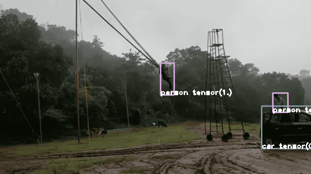

## Computer-Vision

**Hello Everyone !**

**This repo contains both the basics and advance topics of Computer Vision, along with Implemention using Deep Learning with Python.**

### Contents

 * How images are read.

 * Edges, corners, contour as features.

 * Why corners are better features.

 * Color format of images like HSV and RGB.

 * Clustering the parts of image using Kmeans.

 * Face detection.

 * Noise reduction in an image.

 * Filters like LPF, HPF, Sobel etc.

 * Convolutional Neural Network.

 * Classification of Images using CNN.

 * Facial Keypoint detection.

 * Applying Filter on detected facial Keypoints like Snapchat.

 * Brief description on RCNN, FRCNN, Faster RCNN, YOLO etc.

 * Classification of Multiple Object in an image.

 * Tracking and Classifying objects in an Video using Darknet/Yolov3.

 * Creating Basic LSTM network for POS tagging.

 * Generate Next word based on Previous Input using LSTM.

 * Hyperparameters like learning rate, Epoch's, Mini-batch Size, Hidden units/ layers etc

 * Why Attention over Seq2Seq ?

 * Why Transformer better than Attention with RNN ?

 * Image Captioning using Attention.
 
 * Pytorch Implementation of Both NLP and Computer Vision Tasks

 * Sentiment Analysis using Pytorch with RNN Architecture.
 
 * Word/Character Generation using LSTMs
 
 * Generate MNIST Images using GANs
 
 * Generate Celebrity Faces using DCGANs

 * Understanding Optical Flow
 
 * Shi-Tomasi Corner Detector
 
 * Understanding Sense and Move through probability distribution
 
 * 2D Histogram Filter (Monte Carlo)
 
 * Robot Localization through Sense and Move
    
 * Kalman Filter (Gaussian Distribution)
 
 * SLAM - Simultaneous Localization and Mapping
 
 * Landmark Detection
    
    
        To be Continued...
    
