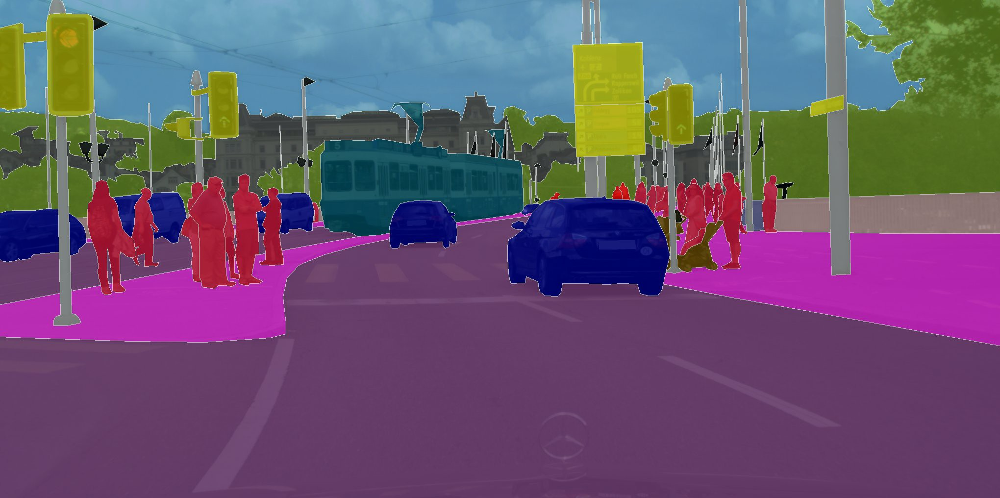

**Objective - Learning Computer-Vision**

To help software engineers to get started with computer vision and deep learning.

| Computer-Vision-Basics | Topic | Notebook Link | Binder |
| :---: | :----:       | :---:       | :---:     |
| Channels | RGB, HSV, etc | ||
| Filters | HPF, LPF, etc | |  |
| Features | Edges, Corners, etc | |  |