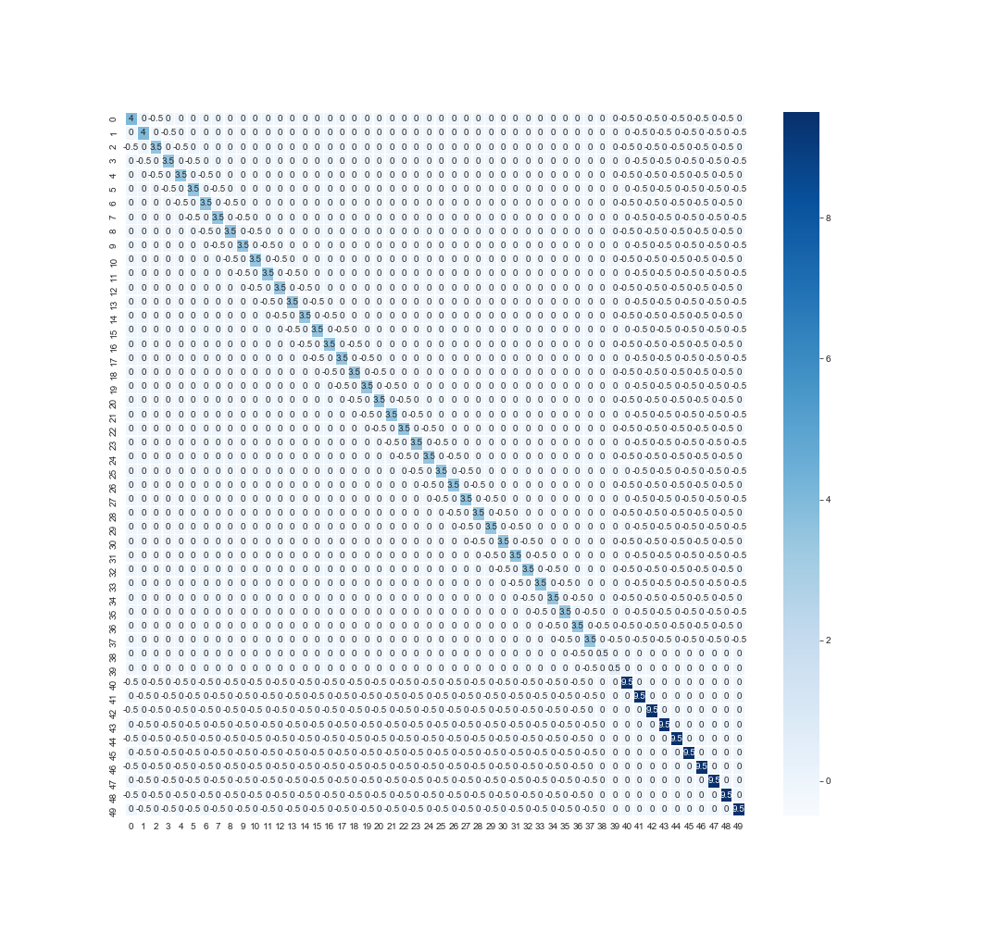
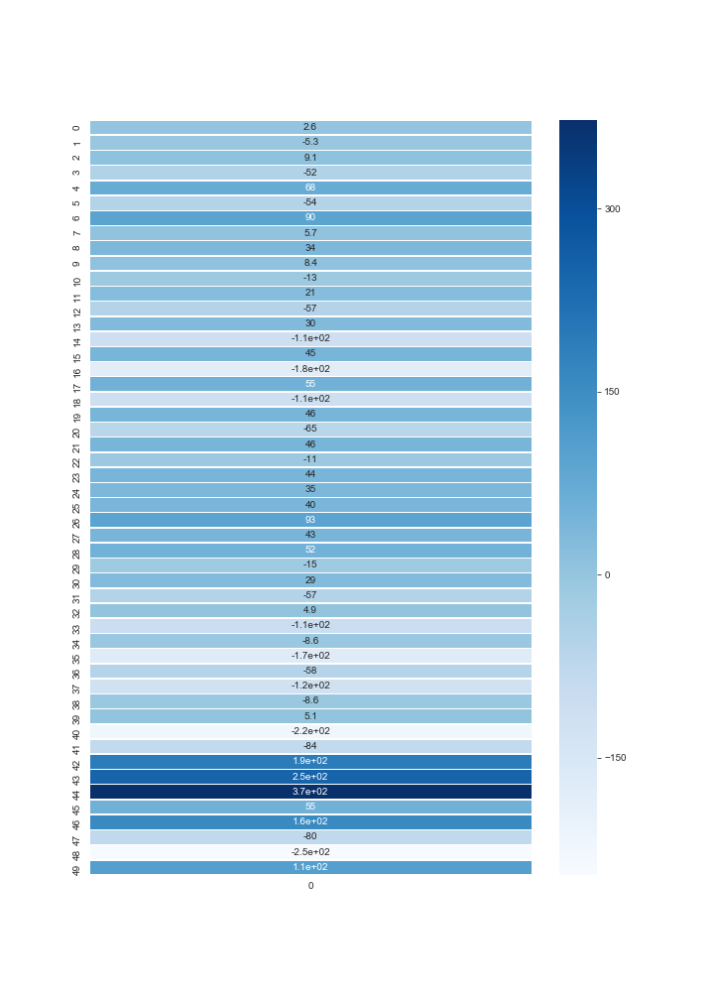
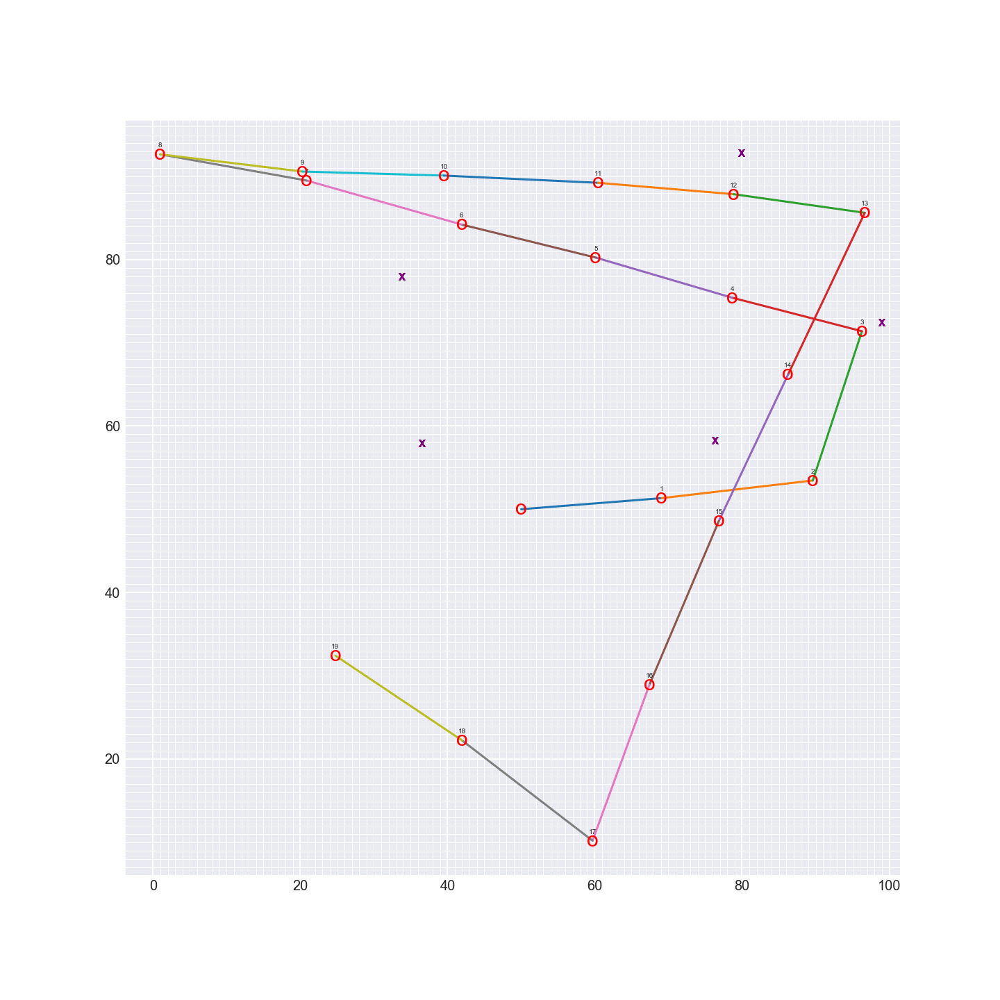

## Objective

To derive a map from a **Self Driving Point**, as it traverses through the 2D world with help of senses and movements. 
SLAM gives us a way to both localize a robot and build up a map of its environment as a robot moves and senses in real-time. This is an active area of research in the fields of robotics and autonomous systems. Since this localization and map-building relies on the visual sensing of landmarks, this is a computer vision problem.

### Technique

SLAM - [Simultaneous Localization and Mapping](https://en.wikipedia.org/wiki/Simultaneous_localization_and_mapping)
is the computational problem of constructing or updating a map of an unknown environment while simultaneously 
keeping track of an agent's location within it.

### Tools & Library
  * Python
  * OpenCV
  * Matplotlib
  * Numpy
  * Seaborn
  
### Description

Implementing SLAM for robot(Point) that moves and senses in a 2 dimensional, grid world!

**Omega and Xi**

To implement Graph SLAM, a matrix and a vector (omega and xi, respectively) are introduced. The matrix is square and labelled with all the robot poses (xi) and all the landmarks (Li). Every time you make an observation, for example, as you move between two poses by some distance dx and can relate those two positions, you can represent this as a numerical relationship in these matrices.

### 1D World

**Omega Matrix and Xi Vector**

Consider the above image, its the constraint of move and senses in 1D world. Inital position X_0 = -3, then it moves +5, i.e.
it moves forward by 5 unit to position X_1. We keep the actual distance as a vector(Xi) and coefficient as Matrix(Omega).
We have study the System of Linear Equation in high school, given two equation solve for x and y. Similarly we are solving for
X_0, X_1,.. X_N given N is our total number of movements.

### Motion Constraints

**Solved System of Equations**

From robot motion, representations of uncertainty in motion and sensing, and localization techniques, we define a function, slam, which takes in six parameters as input and returns the vector mu. mu contains the (x,y) coordinate locations of the robot as it moves, and the positions of landmarks that it senses in the world

### 2D World

The vector, mu, should have (x, y) coordinates interlaced, for example, if there were 2 poses and 2 landmarks, mu will look like the following, where P is the robot position and L the landmark position:
                                mu =  matrix([[Px0],
                                              [Py0],             
                                              [Px1],
                                              [Py1],
                                              [Lx0],
                                              [Ly0],
                                              [Lx1],
                                              [Ly1]])
You can see that mu holds the poses first (x0, y0), (x1, y1), ..., then the landmark locations at the end of the matrix; we consider a nx1 matrix to be a vector.

### Omega After 20 Random Movement updates

### Xi After 20 Random Motion updates

### 2D Map of Traversed Locations
Inital location (50,50)

